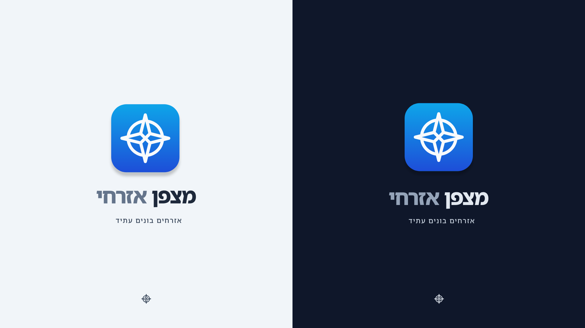
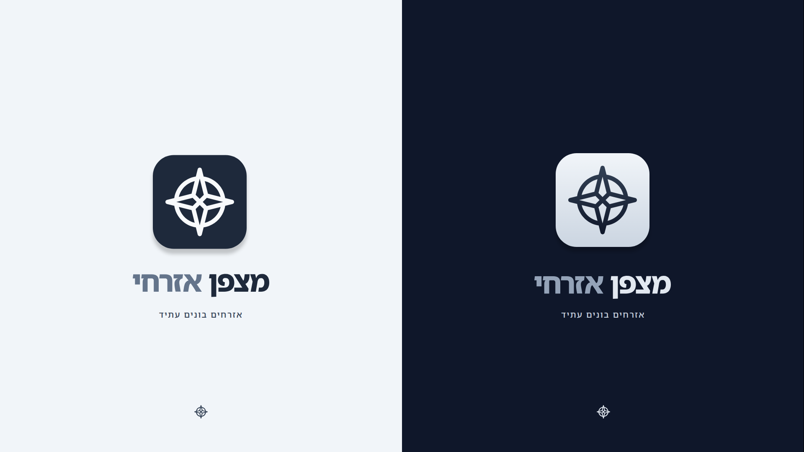

# מצפן אזרחי

> מסמך ביניים לתיאור מבנה נכסי המותג והוראות שימוש בסיסיות

---

## תוכן עניינים

- [מבוא](#מבוא)
- [פלטת הצבעים הרשמית](#פלטת-הצבעים-הרשמית)
- [טיפוגרפיה](#טיפוגרפיה)
- [מבנה הקבצים](#מבנה-הקבצים)
- [גדלי קבצים](#גדלי-קבצים)
- [הוראות שימוש](#הוראות-שימוש)
- [כללי שימוש - מה אסור לעשות](#כללי-שימוש---מה-אסור-לעשות)
- [הנחיות נגישות](#הנחיות-נגישות)
- [סיכום תיקיות וקבצים](#סיכום-תיקיות-וקבצים)
- [שינויים עתידיים](#שינויים-עתידיים)
- [בונוס - דוגמאות שימוש](#בונוס---דוגמאות-שימוש)

---

## לוגו המותג



*הלוגו הרשמי של "מצפן אזרחי" - גרסת מונוטון*

---

## מבוא

ברוכים הבאים למדריך הסגנון של "מצפן אזרחי". מסמך זה נועד להנגיש את נכסי המותג ולספק הוראות ברורות לשימוש נכון בלוגו, באייקון וברכיבים הוויזואליים של המותג.

מסמך זה מהווה **גרסת ביניים** ועשוי להשתנות בעתיד. המטרה העיקרית היא לאפשר לצוות ולשותפים להשתמש בקבצים בצורה נכונה ועקבית.

---

## פלטת הצבעים הרשמית

צבעי המותג מחולקים לקטגוריות לפי תפקידם:

| צבע | קוד HEX | שימוש עיקרי |
|------|---------|-------------|
| כחול | `#1d4ed8` | פעולות ראשיות, קישורים, הדגשים |
| תכלת | `#0095e9` | אלמנטים משניים, כפתורי משנה |
| טורקיז (ראשי) | `#14b8a6` | צבע המותג הראשי, כותרות, לוגו |
| ניטרלי | `#64748b` | טקסט משני, רקעים משניים |

### צבעי רקע

| רקע | קוד HEX | שימוש |
|------|---------|-------|
| כהה | `#0f172a` | רקע למצב Dark |
| בהיר | `#f1f5f9` | רקע למצב Light |

---

## טיפוגרפיה

גופן המותג הרשמי:

**[Noto Sans Hebrew](https://fonts.google.com/noto/specimen/Noto+Sans+Hebrew)**

גופן מודרני, קריא ומותאם לעברית, זמין לשימוש חופשי דרך Google Fonts.

### שילוב באתר

```html
<link href="https://fonts.googleapis.com/css2?family=Noto+Sans+Hebrew:wght@100..900&display=swap" rel="stylesheet">
```

```css
font-family: 'Noto Sans Hebrew', sans-serif;
```

### משקלי גופן מומלצים

| משקל | ערך | שימוש |
|-------|------|-------|
| Light | 300 | טקסט משני, הערות שוליים |
| Regular | 400 | טקסט שוטף, פסקאות |
| Medium | 500 | הדגשים, כותרות משנה |
| Bold | 700 | כותרות ראשיות |

---

## מבנה הקבצים

הקבצים מחולקים לשתי קטגוריות עיקריות:

1. **Logomark** - הלוגומרק, אייקון/סמל
2. **Logotype** - הלוגוטייפ, טקסט

כל קטגוריה מכילה גרסאות שונות לפי רקע ושימוש.

---

### 1. Logomark - סמל/אייקון המותג

האייקון מייצג את "מצפן אזרחי" במצבי שימוש שונים. הוא זמין ב-5 וריאציות עיקריות:

---

#### Base - גרסת בסיס (שקופה)

גרסאות בסיסיות ללא רקע, מתאימות לשילוב על גבי רקעים קיימים.

**נתיב:** `src/Logomark/Base/`

| שם קובץ | גודל | שימוש מומלץ |
|---------|------|-------------|
| `me-logomark-alpha-black-1024.png` | 1024px | רקע בהיר, איכות גבוהה |
| `me-logomark-alpha-black-512.png` | 512px | רקע בהיר, איכות גבוהה |
| `me-logomark-alpha-black-256.png` | 256px | רקע בהיר, גדול |
| `me-logomark-alpha-black-128.png` | 128px | רקע בהיר, בינוני |
| `me-logomark-alpha-black-64.png` | 64px | רקע בהיר, בינוני-קטן |
| `me-logomark-alpha-black-32.png` | 32px | רקע בהיר, קטן |
| `me-logomark-alpha-black-16.png` | 16px | רקע בהיר, Favicon |
| `me-logomark-alpha-white-1024.png` | 1024px | רקע כהה, איכות גבוהה |
| `me-logomark-alpha-white-512.png` | 512px | רקע כהה, איכות גבוהה |
| `me-logomark-alpha-white-256.png` | 256px | רקע כהה, גדול |
| `me-logomark-alpha-white-128.png` | 128px | רקע כהה, בינוני |
| `me-logomark-alpha-white-64.png` | 64px | רקע כהה, בינוני-קטן |
| `me-logomark-alpha-white-32.png` | 32px | רקע כהה, קטן |
| `me-logomark-alpha-white-16.png` | 16px | רקע כהה, Favicon |

---

#### Color - גרסה צבעונית

האייקון בגרסה הצבעונית המלאה. מגיע בשני פורמטים: עיגול (app) וריבוע (square).

**נתיב:** `src/Logomark/Color/`

| שם קובץ | גודל | שימוש מומלץ |
|---------|------|-------------|
| `me-logomark-app-color-1024.png` | 1024px | אייקון אפליקציה, איכות גבוהה |
| `me-logomark-app-color-512.png` | 512px | אייקון אפליקציה, איכות גבוהה |
| `me-logomark-app-color-256.png` | 256px | אייקון אפליקציה, גדול |
| `me-logomark-app-color-128.png` | 128px | אייקון אפליקציה, בינוני |
| `me-logomark-app-color-64.png` | 64px | אייקון אפליקציה, בינוני-קטן |
| `me-logomark-app-color-32.png` | 32px | אייקון אפליקציה, קטן |
| `me-logomark-app-color-16.png` | 16px | אייקון אפליקציה, Favicon |
| `me-logomark-square-color-1024.png` | 1024px | שימוש כללי, איכות גבוהה |
| `me-logomark-square-color-512.png` | 512px | שימוש כללי, איכות גבוהה |
| `me-logomark-square-color-256.png` | 256px | שימוש כללי, גדול |
| `me-logomark-square-color-128.png` | 128px | שימוש כללי, בינוני |
| `me-logomark-square-color-64.png` | 64px | שימוש כללי, בינוני-קטן |
| `me-logomark-square-color-32.png` | 32px | שימוש כללי, קטן |
| `me-logomark-square-color-16.png` | 16px | שימוש כללי, Favicon |

---

#### ColorLight - גרסה צבעונית על רקע בהיר

האייקון בגרסה הצבעונית המלאה עם רקע בהיר מובנה (`#f1f5f9`). מגיע בשני פורמטים: עיגול (app) וריבוע (square).

**נתיב:** `src/Logomark/ColorLight/`

| שם קובץ | גודל | שימוש מומלץ |
|---------|------|-------------|
| `me-logomark-app-color-light-1024.png` | 1024px | רקע בהיר, אייקון אפליקציה |
| `me-logomark-app-color-light-512.png` | 512px | רקע בהיר, אייקון אפליקציה |
| `me-logomark-app-color-light-256.png` | 256px | רקע בהיר, אייקון אפליקציה |
| `me-logomark-app-color-light-128.png` | 128px | רקע בהיר, אייקון אפליקציה |
| `me-logomark-app-color-light-64.png` | 64px | רקע בהיר, אייקון אפליקציה |
| `me-logomark-app-color-light-32.png` | 32px | רקע בהיר, אייקון אפליקציה |
| `me-logomark-app-color-light-16.png` | 16px | רקע בהיר, Favicon |
| `me-logomark-square-color-light-1024.png` | 1024px | רקע בהיר, שימוש כללי |
| `me-logomark-square-color-light-512.png` | 512px | רקע בהיר, שימוש כללי |
| `me-logomark-square-color-light-256.png` | 256px | רקע בהיר, שימוש כללי |
| `me-logomark-square-color-light-128.png` | 128px | רקע בהיר, שימוש כללי |
| `me-logomark-square-color-light-64.png` | 64px | רקע בהיר, שימוש כללי |
| `me-logomark-square-color-light-32.png` | 32px | רקע בהיר, שימוש כללי |
| `me-logomark-square-color-light-16.png` | 16px | רקע בהיר, Favicon |

---

#### Light - גרסת Light Mode

גרסאות מותאמות לרקע בהיר (`#f1f5f9`).

**נתיב:** `src/Logomark/Light/`

| שם קובץ | גודל | שימוש מומלץ |
|---------|------|-------------|
| `me-logomark-app-light-1024.png` | 1024px | רקע בהיר, אייקון אפליקציה |
| `me-logomark-app-light-512.png` | 512px | רקע בהיר, אייקון אפליקציה |
| `me-logomark-app-light-256.png` | 256px | רקע בהיר, אייקון אפליקציה |
| `me-logomark-app-light-128.png` | 128px | רקע בהיר, אייקון אפליקציה |
| `me-logomark-app-light-64.png` | 64px | רקע בהיר, אייקון אפליקציה |
| `me-logomark-app-light-32.png` | 32px | רקע בהיר, אייקון אפליקציה |
| `me-logomark-app-light-16.png` | 16px | רקע בהיר, Favicon |
| `me-logomark-square-light-1024.png` | 1024px | רקע בהיר, שימוש כללי |
| `me-logomark-square-light-512.png` | 512px | רקע בהיר, שימוש כללי |
| `me-logomark-square-light-256.png` | 256px | רקע בהיר, שימוש כללי |
| `me-logomark-square-light-128.png` | 128px | רקע בהיר, שימוש כללי |
| `me-logomark-square-light-64.png` | 64px | רקע בהיר, שימוש כללי |
| `me-logomark-square-light-32.png` | 32px | רקע בהיר, שימוש כללי |
| `me-logomark-square-light-16.png` | 16px | רקע בהיר, Favicon |

---

#### Dark - גרסת Dark Mode

גרסאות מותאמות לרקע כהה (`#0f172a`).

**נתיב:** `src/Logomark/Dark/`

| שם קובץ | גודל | שימוש מומלץ |
|---------|------|-------------|
| `me-logomark-app-dark-1024.png` | 1024px | רקע כהה, אייקון אפליקציה |
| `me-logomark-app-dark-512.png` | 512px | רקע כהה, אייקון אפליקציה |
| `me-logomark-app-dark-256.png` | 256px | רקע כהה, אייקון אפליקציה |
| `me-logomark-app-dark-128.png` | 128px | רקע כהה, אייקון אפליקציה |
| `me-logomark-app-dark-64.png` | 64px | רקע כהה, אייקון אפליקציה |
| `me-logomark-app-dark-32.png` | 32px | רקע כהה, אייקון אפליקציה |
| `me-logomark-app-dark-16.png` | 16px | רקע כהה, Favicon |
| `me-logomark-square-dark-1024.png` | 1024px | רקע כהה, שימוש כללי |
| `me-logomark-square-dark-512.png` | 512px | רקע כהה, שימוש כללי |
| `me-logomark-square-dark-256.png` | 256px | רקע כהה, שימוש כללי |
| `me-logomark-square-dark-128.png` | 128px | רקע כהה, שימוש כללי |
| `me-logomark-square-dark-64.png` | 64px | רקע כהה, שימוש כללי |
| `me-logomark-square-dark-32.png` | 32px | רקע כהה, שימוש כללי |
| `me-logomark-square-dark-16.png` | 16px | רקע כהה, Favicon |

---

#### Source - קבצי מקור (SVG)

קבצים וקטוריים לעריכה בגודל 1024px.

**נתיב:** `src/Logomark/Source/`

| שם קובץ | פורמט | שימוש |
|---------|-------|-------|
| `me-logomark-color-shadow-1024.svg` | SVG | עריכה, שינוי גודל, יצירת גרסאות חדשות |
| `me-logomark-color-light-shadow-1024.svg` | SVG | עריכה, שינוי גודל, יצירת גרסאות חדשות |
| `me-logomark-dark-shadow-1024.svg` | SVG | עריכה, שינוי גודל, יצירת גרסאות חדשות |
| `me-logomark-light-shadow-1024.svg` | SVG | עריכה, שינוי גודל, יצירת גרסאות חדשות |

---

### 2. Logotype - הלוגוטייפ, טקסט

הלוגוטייפ, כולל את שם המותג "מצפן אזרחי".

---

#### Light - גרסת Light Mode

**נתיב:** `src/Logotype/Light/`

| שם קובץ | גודל | שימוש מומלץ |
|---------|------|-------------|
| `me-logotype-light-1024.png` | 1024px | רקע בהיר, איכות גבוהה |
| `me-logotype-light-512.png` | 512px | רקע בהיר, גדול |
| `me-logotype-light-256.png` | 256px | רקע בהיר, בינוני |

---

#### Dark - גרסת Dark Mode

**נתיב:** `src/Logotype/Dark/`

| שם קובץ | גודל | שימוש מומלץ |
|---------|------|-------------|
| `me-logotype-dark-1024.png` | 1024px | רקע כהה, איכות גבוהה |
| `me-logotype-dark-512.png` | 512px | רקע כהה, גדול |
| `me-logotype-dark-256.png` | 256px | רקע כהה, בינוני |

---

#### Source - קבצי מקור (SVG)

**נתיב:** `src/Logotype/Source/`

| שם קובץ | פורמט | שימוש |
|---------|-------|-------|
| `me-logotype-source-dark.svg` | SVG | עריכה, שינוי גודל, יצירת גרסאות חדשות |
| `me-logotype-source-light.svg` | SVG | עריכה, שינוי גודל, יצירת גרסאות חדשות |

---

## גדלי קבצים

כל קובץ זמין במספר גדלים (ב-pixels):

| גודל | שימוש אופייני |
|------|---------------|
| **1024px** | איכות גבוהה, הדפסה |
| **512px** | לוגו גדול |
| **256px** | לוגו בגודל בינוני |
| **128px** | אייקונים גדולים |
| **64px** | אייקונים בינוניים |
| **32px** | אייקונים קטנים |
| **16px** | Favicon, סמל קטן מאוד |

---

## הוראות שימוש

### בחירת גרסה נכונה

| מצב | רקע | גרסה מומלצת | תיקייה |
|------|------|-------------|--------|
| תלוי בגוון | תלוי ברקע | Base (alpha) | `Logomark/Base/` |
| רקע בהיר | `#f1f5f9` | ColorLight | `Logomark/ColorLight/` |
| רקע כהה | `#0f172a` | Color | `Logomark/Color/` |
| אייקון אפליקציה | כל רקע | Color (app) | `Logomark/Color/` |
| אתר/אפליקציה | כהה (`#0f172a`) | Dark | `Logomark/Dark/` |
| אתר/אפליקציה | בהיר (`#f1f5f9`) | Light | `Logomark/Light/` |

### דוגמאות לקוד

**שימוש ב-Logomark כ-Favicon:**
```html
<link rel="icon" href="src/Logomark/Base/me-logomark-alpha-black-16.png" sizes="16x16">
<link rel="icon" href="src/Logomark/Base/me-logomark-alpha-black-32.png" sizes="32x32">
```

**שימוש ב-Logotype באתר:**
```html

```

**שימוש ב-CSS עם גופן Noto Sans Hebrew:**
```css
@import url('https://fonts.googleapis.com/css2?family=Noto+Sans+Hebrew:wght@100..900&display=swap');

body {
  font-family: 'Noto Sans Hebrew', sans-serif;
  font-weight: 400;
}

h1, h2, h3 {
  font-family: 'Noto Sans Hebrew', sans-serif;
  font-weight: 700;
}
```

---

## כללי שימוש - מה אסור לעשות

| אסור | הסבר |
|------|-------|
| ❌ שינוי פרופורציות | אין למתוח, לכווץ או לעוות את הלוגו |
| ❌ הוספת אפקטים | אין להוסיף צללים, זוהר, מסננים או אפקטים נוספים |
| ❌ שינוי צבעים | השתמש אך ורק בגרסאות המוכנות |
| ❌ שימוש בגרסה שגויה | אל תשתמש בגרסת Light על רקע כהה או להפך |
| ❌ עריכת PNG | לעריכה השתמש תמיד ב-SVG מ-Source |

---

## הנחיות נגישות

- **ניגודיות:** ודא ניגודיות מספקת בין הלוגו לרקע (מינימום 4.5:1)
- **תגי alt:** הוסף תמיד תגי alt מפורטים:

| סוג קובץ | תג alt מומלץ |
|---------|--------------|
| Logomark | `alt="סמל מצפן אזרחי"` |
| Logotype | `alt="לוגו מצפן אזרחי"` |

- **גודל מינימלי:** מומלץ לא להשתמש בגרסה קטנה מ-32px לקריאות מיטבית

---

## סיכום תיקיות וקבצים

```
src
├── Logomark
│   ├── Base
│   │   ├── me-logomark-alpha-black-1024.png
│   │   ├── me-logomark-alpha-black-128.png
│   │   ├── me-logomark-alpha-black-16.png
│   │   ├── me-logomark-alpha-black-256.png
│   │   ├── me-logomark-alpha-black-32.png
│   │   ├── me-logomark-alpha-black-512.png
│   │   ├── me-logomark-alpha-black-64.png
│   │   ├── me-logomark-alpha-white-1024.png
│   │   ├── me-logomark-alpha-white-128.png
│   │   ├── me-logomark-alpha-white-16.png
│   │   ├── me-logomark-alpha-white-256.png
│   │   ├── me-logomark-alpha-white-32.png
│   │   ├── me-logomark-alpha-white-512.png
│   │   └── me-logomark-alpha-white-64.png
│   ├── Color
│   │   ├── me-logomark-app-color-1024.png
│   │   ├── me-logomark-app-color-128.png
│   │   ├── me-logomark-app-color-16.png
│   │   ├── me-logomark-app-color-256.png
│   │   ├── me-logomark-app-color-32.png
│   │   ├── me-logomark-app-color-512.png
│   │   ├── me-logomark-app-color-64.png
│   │   ├── me-logomark-square-color-1024.png
│   │   ├── me-logomark-square-color-128.png
│   │   ├── me-logomark-square-color-16.png
│   │   ├── me-logomark-square-color-256.png
│   │   ├── me-logomark-square-color-32.png
│   │   ├── me-logomark-square-color-512.png
│   │   └── me-logomark-square-color-64.png
│   ├── ColorLight
│   │   ├── me-logomark-app-color-light-1024.png
│   │   ├── me-logomark-app-color-light-128.png
│   │   ├── me-logomark-app-color-light-16.png
│   │   ├── me-logomark-app-color-light-256.png
│   │   ├── me-logomark-app-color-light-32.png
│   │   ├── me-logomark-app-color-light-512.png
│   │   ├── me-logomark-app-color-light-64.png
│   │   ├── me-logomark-square-color-light-1024.png
│   │   ├── me-logomark-square-color-light-128.png
│   │   ├── me-logomark-square-color-light-16.png
│   │   ├── me-logomark-square-color-light-256.png
│   │   ├── me-logomark-square-color-light-32.png
│   │   ├── me-logomark-square-color-light-512.png
│   │   └── me-logomark-square-color-light-64.png
│   ├── Dark
│   │   ├── me-logomark-app-dark-1024.png
│   │   ├── me-logomark-app-dark-128.png
│   │   ├── me-logomark-app-dark-16.png
│   │   ├── me-logomark-app-dark-256.png
│   │   ├── me-logomark-app-dark-32.png
│   │   ├── me-logomark-app-dark-512.png
│   │   ├── me-logomark-app-dark-64.png
│   │   ├── me-logomark-square-dark-1024.png
│   │   ├── me-logomark-square-dark-128.png
│   │   ├── me-logomark-square-dark-16.png
│   │   ├── me-logomark-square-dark-256.png
│   │   ├── me-logomark-square-dark-32.png
│   │   ├── me-logomark-square-dark-512.png
│   │   └── me-logomark-square-dark-64.png
│   ├── Light
│   │   ├── me-logomark-app-light-1024.png
│   │   ├── me-logomark-app-light-128.png
│   │   ├── me-logomark-app-light-16.png
│   │   ├── me-logomark-app-light-256.png
│   │   ├── me-logomark-app-light-32.png
│   │   ├── me-logomark-app-light-512.png
│   │   ├── me-logomark-app-light-64.png
│   │   ├── me-logomark-square-light-1024.png
│   │   ├── me-logomark-square-light-128.png
│   │   ├── me-logomark-square-light-16.png
│   │   ├── me-logomark-square-light-256.png
│   │   ├── me-logomark-square-light-32.png
│   │   ├── me-logomark-square-light-512.png
│   │   └── me-logomark-square-light-64.png
│   └── Source
│       ├── me-logomark-color-light-shadow-1024.svg
│       ├── me-logomark-color-shadow-1024.svg
│       ├── me-logomark-dark-shadow-1024.svg
│       └── me-logomark-light-shadow-1024.svg
└── Logotype
    ├── Dark
    │   ├── me-logotype-dark-1024.png
    │   ├── me-logotype-dark-256.png
    │   └── me-logotype-dark-512.png
    ├── Light
    │   ├── me-logotype-light-1024.png
    │   ├── me-logotype-light-256.png
    │   └── me-logotype-light-512.png
    └── Source
        ├── me-logotype-source-dark.svg
        └── me-logotype-source-light.svg
```

**סה"כ: 12 תיקיות, 82 קבצים**

---

## שינויים עתידיים

מסמך זה הוא **גרסת ביניים**. בעתיד יתווספו:
- הנחיות שימוש מתקדמות
- דוגמאות שימוש ויזואליות
- עמוד אינטרנט ייעודי למותג
- דפוסי שימוש (usage patterns)

---

## בונוס - דוגמאות שימוש

1. [פלטפורמת מצפן אזרחי - דף הבית](examples/images/Matzpen-Ezrachi-Home-Dark-Mode.png)
1. [פלטפורמת מצפן אזרחי - הדגמת תפריט ראשי](examples/images/Matzpen-Ezrachi-Home-Dark-Mode-Menu.png)
2. [תמונת מסך - כהה](examples/images/me-desktop-1920-dark.png)
3. [תמונת מסך - בהיר](examples/images/me-desktop-1920-light.png)
4. [אנימציה - פתיח לוגו](examples/videos/matzpen-ezrachi-logo-intro.mp4)

---

**תאריך עדכון אחרון:** יולי 2026  
**גרסת מסמך:** 0.1.2
